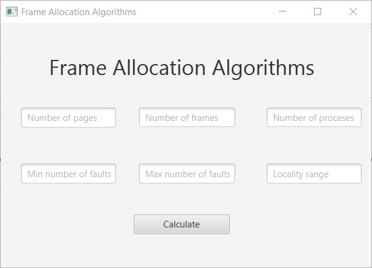
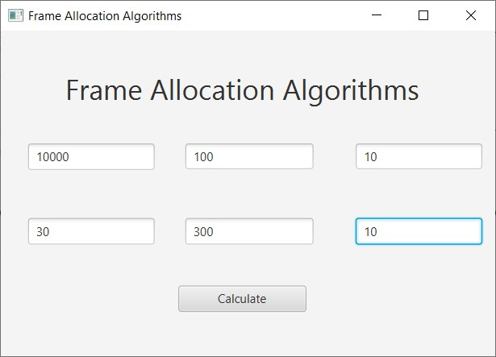
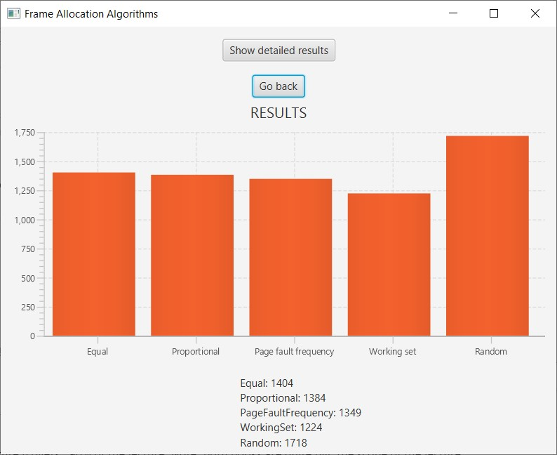
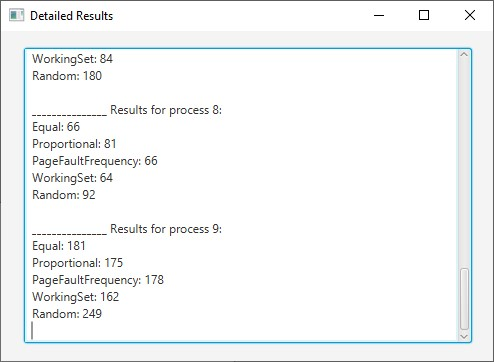
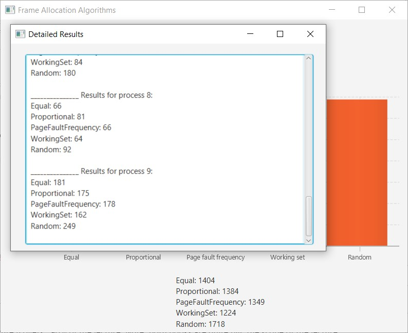

# Introduction

Virtual memory is implemented using demand paging. Demand paging
necessitates the development of a page-replacement algorithm and a frame
allocation algorithm. Frame allocation algorithms are used if you have
multiple processes; it helps decide how many frames to allocate to each
process. There are various constraints to the strategies for the
allocation of frames. To begin with, you cannot allocate more than the
total number of available frames. Moreover, at least a minimum number of
frames should be allocated to each process. This constraint is supported
by two reasons. The first reason is, as less number of frames are
allocated, there is an increase in the page fault ratio, decreasing the
performance of the execution of the process. Secondly, there should be
enough frames to hold all the different pages that any single
instruction can reference.

## Important Page Replacement Terminologies

**Page Fault:** A page fault happens when a running program accesses a
memory page that is mapped into the virtual address space, but not
loaded in physical memory. Since actual physical memory is much smaller
than virtual memory, page faults happen. In case of page fault,
Operating System might have to replace one of the existing pages with
the newly needed page. Different page replacement algorithms suggest
different ways to decide which page to replace. The target for all
algorithms is to reduce the number of page faults.\
**Paging:** Paging is a storage mechanism that allows OS to retrieve
processes from the secondary storage into the main memory in the form of
pages. In the Paging method, the main memory is divided into small
fixed-size blocks of physical memory, which is called frames. The size
of a frame should be kept the same as that of a page to have maximum
utilization of the main memory and to avoid external fragmentation.
Paging is used for faster access to data, and it is a logical concept.\
**Frames:** A frame refers to a storage frame or central storage frame.
In terms of physical memory, it is a fixed sized block in physical
memory space, or a block of central storage. In computer architecture,
frames are analogous to logical address space pages.\
**Locality model:** A locality is a set of pages that are actively used
together. The locality model states that as a process executes, it moves
from one locality to another. A program is generally composed of several
different localities which may overlap.

## Frame Allocation Algorithms

**1. Equal Frame Allocation Algorithm**\
As the name suggests the process will be allocated equally among all the
available processes in the operating system.\
**2. Proportional Frame Allocation Algorithm**\
The proportional frame allocation will allocate the frame on the basis
of the size that is required for execution and the total number of the
frames that the main memory has.\
**3. Random Frame Allocation Algorithm**:\
As the name suggests the process will be allocated equally among all the
available processes in the operating system.\
**4. Page Fault Frequency Algorithm**\
The PFF algorithm uses the measured page fault frequency (by actually
monitoring the inter-page fault interval) as the basic parameter for
memory allocation decision process. This algorithm adapts to dynamic
changes in program behavior during execution. If the page fault rate is
too high, it indicates that the process has too few frames allocated to
it. On the contrary, a low page fault rate indicates that the process
has too many frames.\
**5. Working Set algorithm**\
This model is based on the above-stated concept of the Locality Model.
The basic principle states that if we allocate enough frames to a
process to accommodate its current locality, it will only fault whenever
it moves to some new locality.

# User interface

## Home page

## Entering data

## Calculating and displaying results

## Displaying detailed results in pop-up window

# Features

## Simulation of the following algorithms

- Equal
- Proportional
- Random
- Page Fault Frequency
- Working Set

## Adjustable input parameters

- number of pages
- number of frames
- number of processes
- minimal number of faults
- maximal number of faults
- locality range (working set window / delta)

## Dashboard style visualisation

- GANTT chart
- number of faults

## Detailed results in pop-up window

- scrollable text area with detailed results for every single
  process

# Usage

1. Enter custom data:
   - number of pages
   - number of frames
   - number of processes
   - minimal number of faults
1. Click “calculate” button to display the result
1. Click “display detailed results” button to display detailed results
   for every single process

# Requirements to run this project

​1. Java FX installed\
2. Java 8+

# Conclusion

After performing all calculations one may notice that there are
advantages as well as disadvantages in most of those algorithms. There
is a disadvantage in equal frame allocation, for example, there is a
process that requires more frames for allocation for execution and there
are only a set number of frames that are present for allocation that
will allocate an insufficient number of frames for the process
execution. And the same can happen if the process requires less frame
than the fixed set of frames for allocation. When it comes to
proportional algorithm, it will not waste the frames or assign an
insufficient number of frames to a process as equal algorithm does. But
the disadvantage in the proportional frame allocation is that there is
no priority in the allocation of the frame and it will allocate the
frame based on the size the problem is solved by priority frame
allocation. The random algorithm is definitely the worst. I doesn’t take
into account any important aspect. We may notice also that the accuracy
of the working set algorithm is dependant on the value of parameter A
(locality range). If A is too large, then working sets may overlap. On
the other hand, for smaller values of A, the locality might not be
covered entirely. Similar problem may occur in page fault frequency
algorithm. If the page fault rate is high with no free frames, then some
of the processes can be suspended and frames allocated to them can be
reallocated to other processes. The suspended processes can then be
restarted later.
