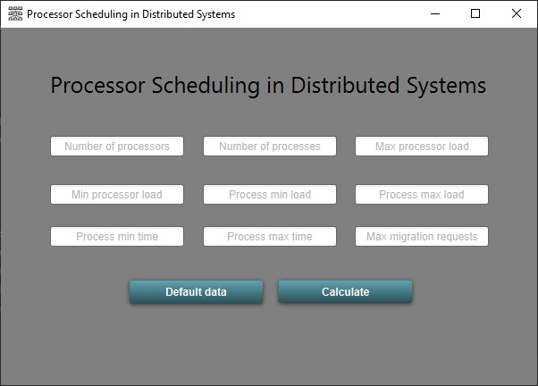
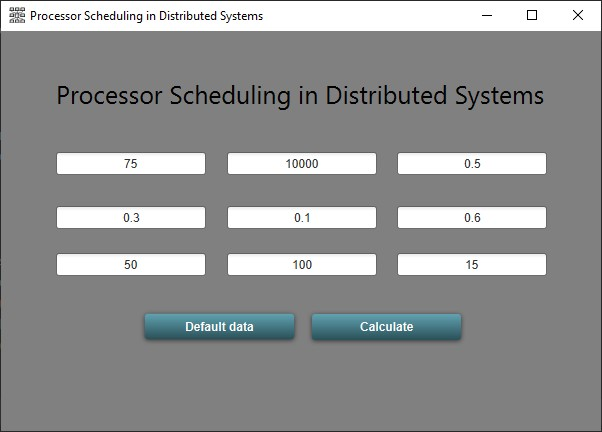
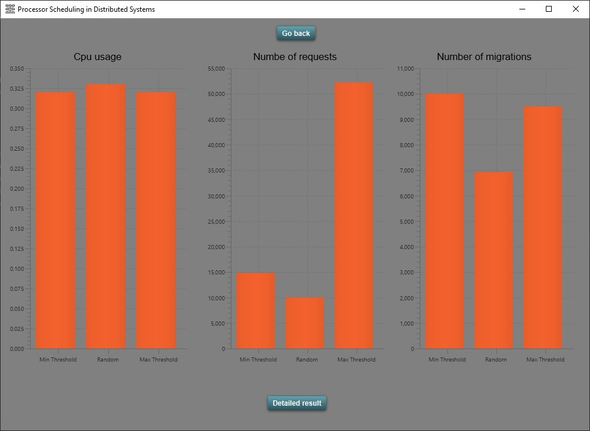
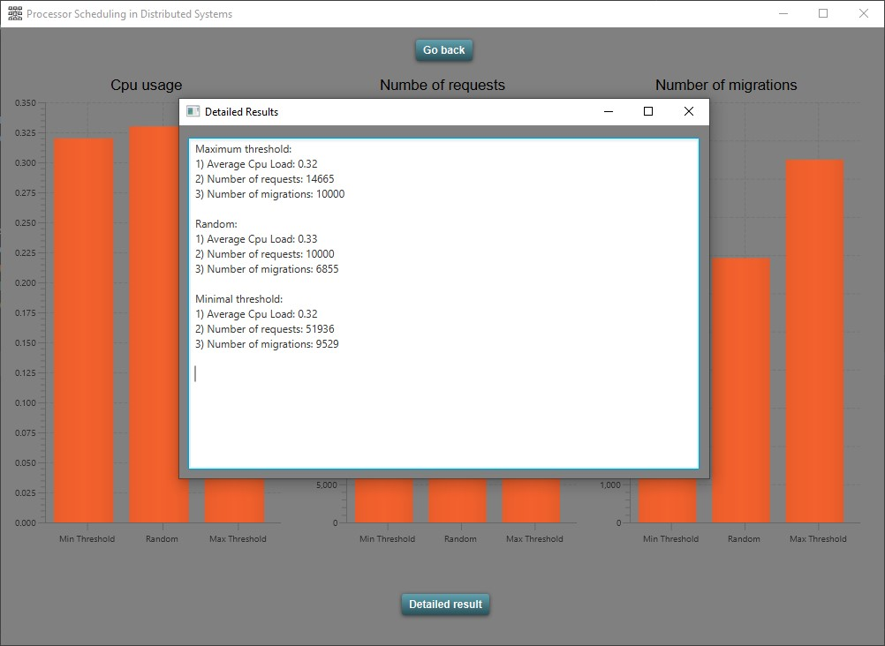
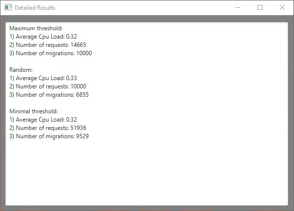

Introduction
============

A distributed system is the collection of autonomous computers that are
connected using a communication network and they communicate with each
other by passing messages. In other words, they are groups of networked
computers which share a common goal for their work. Processor scheduling
is the allocation of a computer’s processor power to specific tasks. In
distributed computing, each processor has its own private memory
(distributed memory). Information is exchanged by passing messages
between the processors.

Important terminologies in Distributed Systems
----------------------------------------------

**Process migration:** Process Migration refers to the mobility of
executing (or suspended) processes in a distributed computing
environment. Usually, this term indicates that a process uses a network
to migrate to another machine to continue its execution there. Process
migration may be used to improve the performance of a distributed system
in a number of areas.
**Process:** Process is the instance of a computer program that is
being executed by one or many threads. It contains the program code and
its activity. Depending on the operating system (OS), a process may be
made up of multiple threads of execution that execute instructions
concurrently.

Algorithms
----------

**1. Maximum Threshold**\
In this algorithm it will be checked as if the cpu load of given
processor is exceeded. If the cpu load is above the maximum limit the
process will be migrated to another processor which can handle this
process.\
**2. Minimum Threshold**\
This algorithm works in a really similar way to maximum threshold
algorithm. If the cpu load is below the minimal threshold then this
processor can handle given process. Otherwise it will search for
processor which load is below minimum.\
**3. Random**:\
As the name suggests the process will be allocated randomly among all
the available processors. Process will be migrated to another processor
when there will be to many processes assigned to particular processor.

User interface
==============

Home page
---------

Entering data
-------------

Calculating and displaying results
----------------------------------

Displaying detailed results in pop-up window
--------------------------------------------

Features
========

Simulation of the following algorithms
--------------------------------------

* Maximum threshold
* Minimum threshold
* Random

Adjustable input parameters
---------------------------

* number of processors
* number of processes
* maximum processor load
* minimum processor load
* maximum process load(how much of processors loa*
* minimum process load
* maximum process time(how much time it will take to*
* minimum process time
* maximum number of migrations requests per process

Dashboard style visualisatio
-----------------------------

* GANTT chart

Detailed results in pop-up window 
---------------------------------

* scrollable text area with detailed results

Usage
=====

1. Enter custom data or click “default data” button to generate data:
    * number of processors
    * number of processes
    * maximum processor load
    * minimum processor load
    * maximum process load
    * minimum process load
    * maximum process time
    * minimum process time
    * maximum number of migrations requests per process
2. Click “calculate” button to display the result\
3. Click “display detailed results” button to display detailed results

Requirements to run this project
================================

​1. Java FX installed\
2. Java 8+

Conclusion
==========

After performing all calculations one may notice that results are highly
dependable on parameters chosen by the user. Maximum and minimum
threshold algorithms results in really similar results. The noticeable
advantage is definitely the fact that we can prevent processors from
being not used at all and from being overloaded and thanks to it
processors will last longer and will deliver better performance. Random
algorithm will be definitely the worst one because using it we cannot
predict the behaviour of distributed systems.
